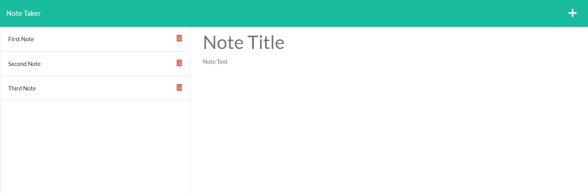
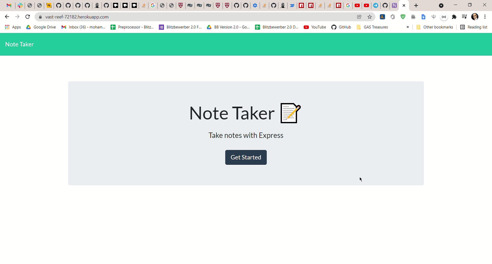

# The-Amazing-Note-Taker
An application to keep notes and retrieve them from an internal database document. 



Deployed on Heroku:
https://vast-reef-72182.herokuapp.com/notes

## Table of Contents

* [Feature](#feature)
* [Technologies](#technologies)
* [Installation](#installation)
* [Usage](#usage)
* [License](#license)
* [Screens](#screens)
* [Questions](#questions)

## Features

* Nodejs backend server that receives and routes requests using ExpressJS
* Server writes to a JSON file as a database
* Application creates notes, saves notes and also deletes notes

## Technologies 

* JavaScript ES6
* HTML5
* CSS3
* Node.js
* npm
* ExpressJS
* Heroku

## Installation 

Following are the steps of installation

```
npm i
```

## Usage 

Unrestricted usage.

## License 

None.

## Screens

This following gif shows the whole journey of the application.




## Questions 

If you have any more questions, please contact me here:

Github Username: [mohamedallam13](https://github.com/mohamedallam13)

Email: [mohamedallam.tu@gmail.com](mailto:mohamedallam.tu@gmail.com)


